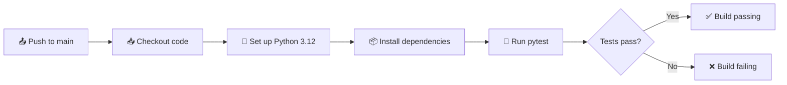

# 🏗️ 04.01 — GitHub Actions: Build & Test Workflow


Part 4 of my hands-on **CI/CD and DevOps** series, and the first **real CI pipeline**. On every push to `main`, GitHub Actions checks out the code, sets up Python, installs dependencies, and runs the test suite automatically. If a test fails, the build fails, and a broken change can't slip through unnoticed.

## 🔄 Pipeline



## 🧩 The Workflow

```yaml
name: Build

on:
  push:
    branches: [main]

jobs:
  build:
    runs-on: ubuntu-latest
    steps:
      - name: Checkout code
        uses: actions/checkout@v6.0.2

      - name: Set up Python
        uses: actions/setup-python@v6.2.0
        with:
          python-version: "3.12"
          cache: pip

      - name: Install dependencies
        run: |
          python -m pip install --upgrade pip
          pip install -r requirements.txt

      - name: Run tests
        run: pytest -v
```

## 🧱 `uses` vs `run`

Every step does one of two things:

| Keyword | What it does | Example |
|---------|--------------|---------|
| `uses` | Runs a **pre-built action** from the GitHub Marketplace | `actions/checkout`, `actions/setup-python` |
| `run` | Executes **shell commands** on the runner | `pip install`, `pytest` |

| Step | Purpose |
|------|---------|
| **Checkout code** | The runner starts empty; this copies the repository onto it |
| **Set up Python** | Installs a specific Python version, with pip caching to speed up future runs |
| **Install dependencies** | Installs everything listed in `requirements.txt` |
| **Run tests** | Runs `pytest`; any failing test fails the whole build |

## 📁 Project Structure

```
├── .github/workflows/main.yml   # CI pipeline
├── app.py                       # Calculator module
├── test_app.py                  # pytest test suite
├── requirements.txt
└── README.md
```

## 💻 Run Tests Locally

```bash
pip install -r requirements.txt
pytest -v
```

## 🧪 Try Breaking the Build

To see CI catch a bug, change `add()` in `app.py` to `return a - b` and push. The **Run tests** step fails and the badge turns red. Revert the change and it goes green again.

## 🎯 What I Learned

- Building a real CI pipeline: checkout → setup → install → test
- The difference between `uses` (actions) and `run` (commands)
- Why the runner needs an explicit checkout step
- Pinning a Python version and caching dependencies
- How failing tests automatically fail a build

## 🗺️ Series Roadmap

- [x] [**01:** Hello World](https://github.com/MMujtabaX/01-github-action-hello-world): workflow anatomy and push triggers
- [x] [**02:** Scheduled Workflows](https://github.com/MMujtabaX/02-github-actions-schedule): cron triggers and manual runs
- [x] [**03:** Disabling Workflows](https://github.com/MMujtabaX/03-github-action-disable-workflow): pausing workflows without deleting them
- [x] **04.01:** Build & Test Workflow (this repo)
- [ ] Linting and build checks on pull requests
- [ ] Using secrets and environment variables
- [ ] Deploying an application automatically

## 👤 Author

**Muhammad Mujtaba Khan Suri** — CS @ UBIT, University of Karachi
[GitHub](https://github.com/MMujtabaX)
